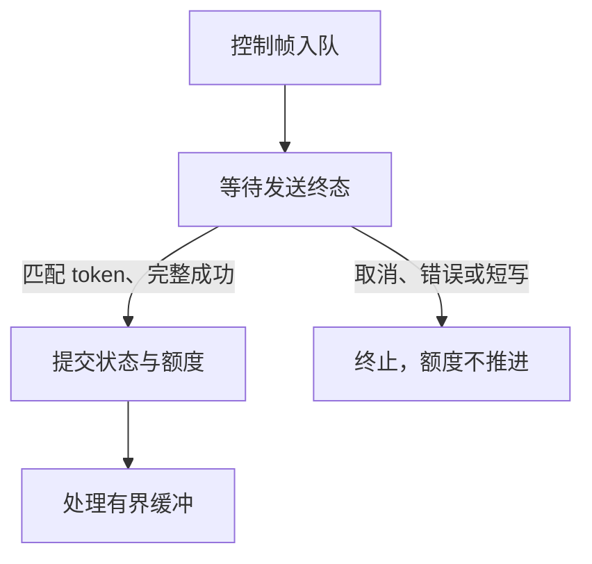
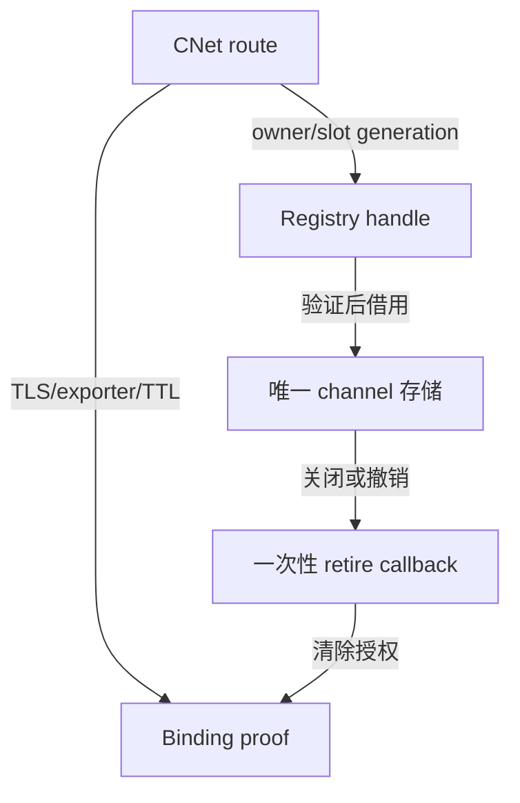
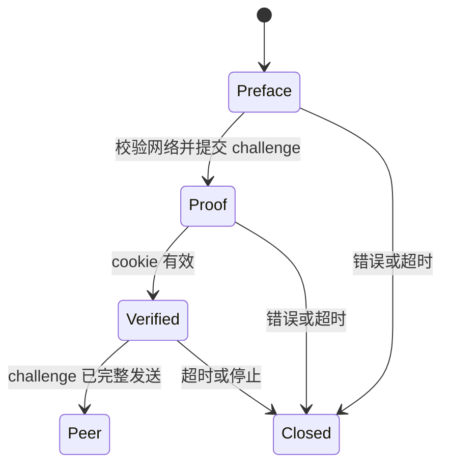

# Salts / SaltsUtils 分阶段迁移

已完成的阶段包括 SHA-256、三个内部容器持有者、异步控制帧发送终态，以及身份绑定核心的加密与随机数迁移、CNet TLS 1.3 三消息身份绑定，以及绑定后的异步 receiver channel、registry 授权路由、tunnel 产品 TCP/TLS 调用方、MMP 异步协议和 CNet TLS 签名 peer。根工程仍需要原有 TurboNet、TurboHttp、TurboParser、TurboUtils SDK；仅安装新 SDK 尚不能构建整个产品。

## 审查发现

- **HIGH（事实）**：根工程和传输实现仍依赖 `TurboNet::CoroNet`。新 Salts 导出 CNet，SaltsNet 并未保留旧 CoroNet API。仅改 target 名称会破坏连接、协程及关闭生命周期。第二阶段须迁移 P2P/stream/tunnel 的 transport owner，并验证断连、取消、重连和 TLS。
- **HIGH（事实）**：新 `Salts::Crypto` 提供 SHA-256 和 Ed448，不提供旧 HMAC、wipe、verify 等完整接口。把所有 `turbo_crypto_*` 机械替换会丢失功能；将既有 Ed25519 签名改为 Ed448 会改变协议。因此本阶段只迁移 SHA-256，保留原有非 SHA provider 和签名算法。
- **MED（事实）**：`TurboParser::Parser` 聚合目标以及 `TurboHttp::Iris` 不能靠命名替换迁移。第三阶段按 parser 组件接入 SaltsUtils，并把 HTTP owner 迁到 CHttp，同时验证网关和控制面请求。
- **MED（事实）**：CSTL 改用 `vec_t`/`deque_t`、显式元素大小与对齐、`STL_OK`。本阶段迁移 outbox、endpoint pool、agent router，保留容量限制、FIFO、payload 所有权及错误映射。
- **MED（事实）**：新 TinyTest 使用 `check_equal`，旧类型专用断言已经移除。基础测试同步迁移，根构建按测试选择对应 runtime；其余测试随后续 owner 迁移。

证据入口：本仓库 `CMakeLists.txt`、`mesh/CMakeLists.txt`、`p2p/src/api/p2p_api.c`、`mesh/src/mesh_control_outbox.c`；上游 [Salts](https://github.com/qigao/salts)、[SaltsUtils](https://github.com/qigao/salts-utils)、[SaltsNet](https://github.com/qigao/salts-net)、[CHttp](https://github.com/qigao/chttp) 的 CMake 导出和公共头文件。

## 依赖与缓存

验证快照为 2026-10-01：

| 依赖 | 版本 | 验证来源 |
| --- | --- | --- |
| Salts | 1.8.9 | commit `3e8078f1d7c43cad71bcf44841553fd567704b5e`，源码安装 SDK |
| SaltsUtils | 4.1.14 | commit `1428b495d2a4ba9c113c98616040f68fd21448b6`，[发布流水线](https://github.com/qigao/salts-utils/actions/runs/36800213494) 的 Linux SDK |
| re2c | upstream 4.6 / package 4.6.3 | [vcpkg-cache 发布流水线](https://github.com/qigao/vcpkg-cache/actions/runs/36543809871) 的 host binary |

与 CHttp 一致，CI 使用共享 `setup-vcpkg-cache@master`，并通过 `setup-re2c-tools@master` 恢复最新 `Qigao.Re2c.Binary`。不从 re2c 源码独立 bootstrap，也不使用系统包版本覆盖共享缓存。CI 从 GitHub Packages 恢复最新已发布的 `Salts.Native` 和 `SaltsUtils.Native`，以 `SALTS_ROOT` / `SALTS_UTILS_ROOT` 指向匹配平台的 SDK。

基础测试直接消费安装 SDK，本身不生成 parser。Linux SDK 的 Crypto 依赖 OpenSSL；该测试任务使用 runner 的 `libssl-dev`，关闭 vcpkg manifest 恢复，以免拉入尚未迁移的根工程依赖。共享缓存和 re2c 设置仍由统一 action 提供。

NuGet 实际最新已发布包为 SaltsUtils.Native 4.1.13（首轮 CI 恢复记录）；4.1.14 是源码与 SDK artifact 版本。两版 `crypto/` 及 `cmake/SaltsUtilsConfig.cmake.in` 经 Git diff 确认无差异，消费方不声明依赖版本号，继续恢复 `Version="*"` 的最新发布包。本地同时验证 4.1.14 SDK；所需组件或 API 缺失时直接配置/编译失败。系统 OpenSSL 3.0.13 下也为 9/9 通过。

## 兼容性与取舍

SHA-256 的输入、域分隔、输出长度和现有签名算法保持不变；没有修改协议或持久化格式。CID 定义从文件存储头文件拆到 `m3_chunk_cid.h`，原类型及布局不变，使媒体清单不再通过类型依赖旧文件系统。

选择分阶段迁移是为了分别验证容器/摘要、网络生命周期与 HTTP/parser owner。一次性改名不能覆盖这些接口差异；长期维护一套旧名称兼容层会增加双 runtime 和状态归属风险。基础阶段的主要代价是根构建暂时同时需要新旧 SDK。合并前需具备匹配的 legacy SDK 并运行根工程回归；没有完成该验证之前保留草稿状态。

回滚可撤销本阶段提交并恢复原依赖配置，无需数据迁移。容器生命周期仍由原 owner 管理；初始化失败继续返回既有错误，关闭路径继续释放原有 payload。

## 可重复验证

准备安装 SDK、CMake >= 3.27、C/C++ 编译器和 OpenSSL 开发包，然后设置 `SALTS_ROOT`、`SALTS_UTILS_ROOT`；动态 SDK 还需将相应 `lib` 目录加入运行时库搜索路径。

```sh
cmake -S tests/salts_foundation -B build/salts-foundation -G Ninja -DCMAKE_BUILD_TYPE=Release
cmake --build build/salts-foundation --parallel 2
ctest --test-dir build/salts-foundation --output-on-failure
```

远程 [基础 CI](https://github.com/qigao/turboP2P/actions/runs/36870582481) 已使用 GitHub Packages 的 Salts.Native 1.8.9、SaltsUtils.Native 4.1.13 和缓存 re2c 4.6.3 完成构建，9/9 CTest 通过。版本仅记录验证快照，消费方 CMake 不限制版本。

本地结果：9/9 CTest 通过，覆盖 outbox FIFO/容量、可靠流丢包/重排/恢复、多源选择、媒体索引、playlist、release、媒体拉取及 SHA-256 标准向量/增量/错误状态。endpoint pool 和 agent router 的真实源码通过编译检查；其 P2P 生命周期测试需要根构建，不在这 9 个测试中。

ASan/UBSan 构建也为 9/9 通过。当前执行环境无法让 LeakSanitizer 读取 `/proc`，因此该轮设置 `ASAN_OPTIONS=detect_leaks=0`；不据此声称完成泄漏检测。

尚未验证完整根工程、Windows/macOS、CoroNet/TLS、HTTP 网关和 FlowMQ 集成。后续阶段须验证这些范围后，才能移除 legacy SDK 依赖并宣称完成整个迁移。


## 第二阶段 A：控制帧发送终态

**HIGH（事实）**：旧 `mesh_stream_transport` 在 `io.send()` 返回零时立即提交 ACCEPT / WINDOW_UPDATE；这是同步传输契约。CNet 的 `cnet_send_buffer()` / `cnet_send_slicev()` 返回成功只代表入队，`cnet_observer.on_send` 才报告完整 ordered write 成功。错误或关闭走连接状态回调。若直接换接口，流会提前进入 ACTIVE 或提前增加 advertised window。

本阶段新增内部 `mesh_stream_transport_init_async_v1` 与 `mesh_stream_transport_complete_send_v1`。同步入口继续使用原完成语义，异步入口显式禁止 `io.send`，不能因后端缺失而回退。异步 send 的 token 来自 session preparation generation；终态须匹配 token 和完整编码长度。发送完成前最多保留一个 pending control，暂停后续帧处理，仅保留原 `max_frame_size` 上限内的字节。成功提交后继续处理缓冲，取消/错误/短写使 transport 进入 FAILED，保留已消费 DATA 的事实，不增加额度。



连接与 transport 由同一个 owner 串行推进，不能在 send admission 内完成回调。CNet 的成功回调没有业务 tag，adapter 必须按专属连接的 write FIFO 映射 token，不能混入未登记的写操作。destroy/reinitialize 前须让旧连接回调静默，避免跨 lifetime token 复用。重连应创建新的连接 handle 和授权状态；不能沿用旧 TLS exporter 或 bind ticket。

验证：原同步 transport 测试继续通过；新增延迟完成、WINDOW_UPDATE 取消、短写、重复/过期 token、入队拒绝、有界缓冲测试。真实 CNet TLS 回环验证 exporter 一致、retained buffer 可在入队后释放调用方引用、`on_send` 才激活 ACCEPT、对端解码正确，以及 close-before-progress 不激活 ACCEPT。基础构建增加到 11 个 CTest，Release 和 ASan/UBSan 均为 11/11 通过；sanitizer 轮仍因当前环境限制设置 `detect_leaks=0`。

此阶段仅打通控制帧终态，不替代身份授权。现有三消息身份绑定的 CONFIRM 成功后发布授权、ACCEPT 发送歧义 tombstone，以及 exporter/connection generation 核对，仍需要专用 CNet bind owner 的后续迁移。根工程的 CoroNet owner、HTTP、tunnel 和 P2P transport 尚未切换；不能据此移除全部 legacy SDK。


## 第二阶段 B：身份绑定核心与 TLS 门禁审查

`mesh_mgmt_crypto` 的 BLAKE2b-256、常量时间比较和 secure wipe 改为仓库已有的 `vendor/monocypher`；Ed25519 继续使用 OpenSSL EVP，不能替换成 Monocypher 的 BLAKE2b EdDSA。退休的 TurboNet crypto wrapper 本身也调用这些 Monocypher primitives，固定 16/32 字节比较的返回值继续归一化为原有 0/1。无新增第三方依赖、算法实现或 fallback。`mesh_stream_bind` 的票据 ID 与握手 nonce 改由 `Salts::Platform` 的 `salts_platform_secure_random` 提供。

签名域字符串、Ed25519/BLAKE2b 算法、INIT/ACCEPT/CONFIRM 字节布局、票据容量/TTL、消费与 tombstone 语义保持不变。根工程目标显式链接 Monocypher 和 Salts Platform；绑定核心不再依赖 TurboUtils/TurboNet。独立基础构建增加管理加密和三消息绑定的真实生产源码及测试，测试使用 Salts TinyTest。

**HIGH（事实，已解决）**：此前 CNet 缺少公开协商版本查询，exporter 成功不能证明 TLS 1.3。[Salts #658](https://github.com/qigao/salts/issues/658) 已关闭；当前发布 SDK 提供 `cnet_tls_negotiated_version`。第二阶段 C 在每次 exporter 查询之前校验返回的完整 `TLSv1.3` 字符串，使用公开 API，不读取 CNet 私有状态。

验证包括 RFC 8032 Ed25519 标准向量及篡改拒绝，BLAKE2b-256 空输入、abc 和 129 字节跨块向量，固定长度比较、wipe 与参数错误，以及既有三消息互认证、重放拒绝、exporter 错配、各阶段篡改、票据过期/容量、角色反射、截断输入和 tombstone 测试。回滚可撤销此阶段提交，不涉及数据转换。完整根工程和跨平台 transport owner 验证仍待后续阶段。

本阶段本地 Release 与 ASan/UBSan 均为 13/13 CTest 通过；sanitizer 设置 `detect_leaks=0`，不声称完成泄漏检测。


## 第二阶段 C：CNet 三消息身份绑定

新增内部 `mesh_stream_cnet_adapter`，复用既有绑定核心及 INIT 368 / ACCEPT 232 / CONFIRM 200 字节协议。连接、绑定对象和 responder store 由同一事件循环 owner 串行推进；对象借用 CNet client/handle 和 store，私钥只在签名调用期间借用。输入由调用方按固定握手尺寸组帧，早到的回复须有界缓冲，不能把应用数据交给绑定器。

每次 init、握手推进、发送完成和授权查询都先用 `cnet_tls_negotiated_version` 验证完整 `TLSv1.3`，再导出并核对原 exporter。TLS 1.2、明文、未连接/关闭、stale handle 或 exporter 不匹配均拒绝，不增加版本 pin 或 fallback。INIT / ACCEPT / CONFIRM 的入队成功只保留一份 retained buffer 和 pending 状态；发送完成必须匹配 slot/generation 与完整字节数。initiator 仅在 CONFIRM 的 `on_send` 成功后发布票据；responder 仅在收到、验证 CONFIRM 并一次性消费原 INIT 的票据后授权。

**HIGH（事实，已处理）**：CNet close 是异步命令，排队中的写可能在处理关闭时成功完成。调用方须先 `mesh_stream_cnet_bind_abort_v1` 再请求 close，且在 CLOSED/FAILED 回调中再次 abort。取消、短写、错误和 exporter 失效清除票据、transcript 与 exporter；已接受的 INIT 被 tombstone，迟到或重复 terminal 不恢复授权。一个连接在绑定完成前只能有该 owner 的单个 pending write；不能夹入其他写或在 callbacks 静默前重用对象。init 失败不保留连接或凭据，终态错误后须关闭 borrowed handle。

授权查询同时核对活连接的 TLS 1.3/exporter、票据有效期、remote peer、stream ID/epoch 和 admission generation。代码范例为可运行的 `mesh/tests/test_mesh_stream_cnet_bind.c`。新 target 独立于 CoroNet；完整产品 owner 接线仍属于后续迁移，此阶段不移除根工程的 legacy SDK。

验证使用最新发布的 Salts / SaltsUtils SDK。真实 CNet TLS 1.3 回环覆盖三消息、CONFIRM terminal 才授权、一次性消费、关闭/取消、stale/duplicate terminal、短写、完成时过期、篡改和 exporter 错配。真实 OpenSSL TLS 1.2 client 通过公开 plaintext CNet 驱动，与 CNet TLS listener 握手后确认两端协商版本为 TLS 1.2，验证 binder 在 INIT 入队前拒绝；明文、stale 和关闭连接也拒绝。该负例客户端保留 CA/hostname 校验，针对 GmSSL TLS 1.2 缺少 RFC 5746 的情况仅允许初次 legacy handshake，并禁用 renegotiation；生产门禁仍只接受 TLS 1.3。

当前 GmSSL 拒绝缺少 Basic Constraints 的旧自签名 fixture。CNet 回归改用上游现有的独立 CA/leaf/key 测试链，保持证书和主机名校验，来源与有效期见 `mesh/tests/data/CNET_TLS_FIXTURES.md`。re2c 继续从共享 vcpkg-cache 发布包恢复，consumer 配置继续选 latest SDK。

回滚可撤销本阶段提交，不涉及数据或报文转换。尚未验证完整根工程及 Windows/macOS；P2P、tunnel、HTTP owner 和完整 channel 接线仍待后续阶段。

本地发布包快照：Salts 1.8.15 / SaltsUtils 4.1.17（仅记录验证输入，不限制 consumer 版本）。Release 14/14 CTest、ASan/UBSan 14/14 通过；最后新增 exporter 错配测试后的 sanitizer 绑定回归亦通过。当前环境仍设置 `ASAN_OPTIONS=detect_leaks=0`，不声称完成泄漏检测。


## 第二阶段 D：授权后的 CNet receiver channel

`mesh_stream_channel_init_async_v1` 与 `mesh_stream_channel_complete_send_v1` 将现有 generation、资源释放和终态诊断契约接到异步 transport。同步入口保留原行为，async 必须有 admission callback 且 `io.send == NULL`；不能调用同步 pump，也不能自动回退。过期 admission 或 send token 在进入通用失败清理前被拒绝，不会销毁仍在使用的 receive window 或取消较新的 pending control。

CNet adapter 的 `mesh_stream_cnet_channel_v1_t` 借用已完成绑定的对象、client 和精确 slot/generation，拥有一个 channel。init、feed、matching terminal，以及 buffered-frame 的应用回调和 control send 均检查活 TLS 1.3/exporter、TTL、身份和 stream/generation。授权失效先 REVOKED 并释放 window，再清除绑定；传输终态错误保留诊断和已消费帧统计，清除绑定。旧 handle、旧 admission 和旧 token 不推进新 channel，也不能关闭新连接的授权。

**HIGH（事实，已处理）**：ACCEPT 成功的 terminal 可能排队下一份 WINDOW_UPDATE。只有匹配当前 pending token 的终态才可提交；不能把旧 ACCEPT 回调当成下一次控制帧成功。终态处理会 drain 已缓冲的 DATA，因此调用方须在处理回调前捕获 token，并保持连接的专属 write FIFO。每份 control 使用独立 retained buffer；入队后立即释放调用方引用，CNet 持有至逻辑 write 完成。

**MED（事实，显式 owner 契约）**：当前 CNet `max_send_bytes` / `read_timeout_ms` 在 client 创建时确定，没有逐连接 HWM/timeout setter。channel 的 policy callbacks 必须应用或验证创建该 client 的实际配置，不得成功 no-op。真实测试由创建 client 的同一配置给出验证，HWM 或 timeout 不匹配即失败。adapter 不提交 receive demand，也不替调用方关闭 borrowed handle；owner 一次请求一个 receive，pending control 期间暂停后续 demand，早到的字节仅使用 `max_frame_size` 窗口。调用路径见可运行的 `mesh/tests/test_mesh_stream_cnet_channel.c` 与共享 `mesh_stream_cnet_fixture.h`。

本阶段把 transport/channel/registry 的纯核心拆为内部 `mesh_stream_transport_core`，CNet target 直接链接它；原 `mesh_stream_transport` target 保留 CoroNet adapter 和 transitive core 符号，现有 CoroNet 调用方不变。通用 channel 的既有七个 lifecycle 测试迁至 Salts TinyTest，并加入显式 async、拒绝混合 IO、禁止同步 pump 和 obsolete terminal 保护；原绑定回归共享 fixture 后继续执行。

真实 TLS 测试先执行 INIT/ACCEPT/CONFIRM，再传输 OPEN/DATA。测试延迟 owner 对实际 CNet `on_send` 的 settlement，验证 ACCEPT 前不 ACTIVE、WINDOW_UPDATE 前 receive_limit 不增加，且对端控制帧解码正确。还覆盖一次 TLS write 中的 OPEN/DATA 有界缓冲、取消 pending control、授权撤销后不交付 DATA、完成时 TTL 过期、短 terminal、stale handle/admission/token，pending control 期间窗口溢出立即失败，以及同一 CNet client 上的关闭→重新连接→重新绑定，确认旧回调不能操作新 channel。

取消不能撤回已经写入网络的字节；清除授权后 owner 必须关闭连接，确保旧 grant 不再接受新的 DATA。应用回调不能重入 adapter。所有对象在 callbacks 静默前禁止销毁或重用。撤销本阶段提交无需数据转换或 wire-protocol 变更。

完整根工程、Windows/macOS、registry 的 CNet 接线及 P2P/tunnel/HTTP owner 仍待后续验证；此阶段只完成独立 receiver channel 路径。

本阶段本地 Release 16/16 CTest、ASan/UBSan 16/16 通过，使用 Salts 1.8.15 / SaltsUtils 4.1.17 发布包快照；consumer 不限制版本。sanitizer 仍设 `detect_leaks=0`，不声称完成泄漏检测。CI 延续 latest Packages 与共享 vcpkg-cache/re2c。


## 第二阶段 E：异步 registry 与 CNet 授权路由

**HIGH（事实，已处理）**：原 registry 只初始化同步 channel；把 CNet adapter 内嵌的 channel 再复制进 registry 会产生两套 session/window 和生命周期。现在新增显式 `mesh_stream_registry_open_async_v1` / `complete_send_v1`，与同步入口共享重复流、总容量、每 peer 配额及 slot generation 检查。没有 async callback 或混入同步 send 立即失败；初始化失败不占槽位、不推进 generation、不发布 handle。

CNet 的 `mesh_stream_cnet_channel_register_v1` 先验证完整 TLS 1.3 绑定，并在 registry 初始化 channel 时验证实际 client policy，注册同一发送/应用回调。registry 是 channel 存储的唯一 owner；route 的 standalone 存储保持零，只持有 borrowed registry 与带 owner/slot generation 的 handle。每个 receive、terminal、应用事件和 control send 都通过 handle 借用当前存储，并执行原有 exporter/TTL/身份/stream 门禁。指针只在同一次 owner 调用内有效，不能缓存到 release/destroy 之后。



**HIGH（事实，已处理）**：registry 的 close/revoke/destroy 必须清除绑定授权，不能只释放 transport window。每个 async slot 可登记一次性 retire observer，终态先保留诊断和计数，再在 release/reuse 前通知 owner；callback 在调用前从 slot 清除，重复关闭、释放或销毁不重复通知。CNet 注册路径用它 abort 精确 borrowed binding。终态槽位继续占用配额并可查询，只有明确 release 才可复用。stale route 在访问 borrowed binding 前先验证 registry handle，因此不能撤销 replacement binding。

**MED（事实，已处理）**：原 query 在 READY 状态读取仅在 terminal 时保存的计数，活跃 channel 的统计始终为零。现在 READY 直接读取唯一 transport 的实时 received bytes/frames/control frames；terminal 查询沿用关闭时的最终快照，不改变 channel 状态。

方案比较：独立维护第二套 CNet registry 会重复配额和句柄策略；复制 channel 会破坏唯一状态；让通用 core 直接依赖 CNet 则扩大 backend 依赖。当前选择 backend-neutral async registry + 注册 route + retire observer，通用 core 不引入 CNet API。原 synchronous registry 与 standalone CNet 入口继续有各自明确语义，新入口不自动选择或降级后端。代价是 borrowed route/context 必须存活至 retirement，并且 caller 必须统一生命周期。

owner 契约：所有操作及 policy/application/retire callbacks 串行且禁止重入；仍只提交一个 receive demand，control pending 时暂停 demand；CNet 连接专属 write FIFO 不混入未登记写。close/revoke 清除授权后 caller 请求 socket close，并等待全部 callbacks 静默；此后才 release slot、destroy registry 或复用 route。registry 对象本身必须比 route 活得更久，同地址重建必须改变 owner_generation。route destroy 在注册模式下只 retire slot，不代替 release，也不关闭 borrowed CNet client。

验证包含既有六个同步 registry 回归及四个异步核心回归；真实 TLS 三消息绑定后 OPEN/DATA、对端 control 解码和按实际 on_send settlement 提交 credit；未认证、policy 错误、重复、总容量/peer 配额拒绝不损伤现有授权；关闭、匹配 peer generation 撤销、短 terminal、TTL 过期、abort 后实际 DATA 拒绝、静默 registry destroy；同一 CNet clients 重连及同地址 registry 重建后，旧 handle/token/route 的 feed/terminal/close/destroy 不影响新 grant。

撤销本阶段不涉及 wire 格式或数据转换。完整根工程、Windows/macOS、多核 owner qualification，以及 P2P/tunnel/HTTP 产品调用方仍需迁移和验证；此阶段没有移除全部 legacy SDK。

本阶段本地 Release 与 ASan/UBSan 均为 18/18 CTest 通过，使用 Salts 1.8.15 / SaltsUtils 4.1.17 发布包验证快照；依赖仍 floating/latest。sanitizer 设置 detect_leaks=0，不声称完成泄漏检测。re2c 延续共享 vcpkg-cache，无 bootstrap。

## 第二阶段 F：tunnel 产品 TCP/TLS 调用方

**HIGH（事实，已修复）**：旧 HTTP CONNECT 用 `strstr` 扫描非 NUL 的网络缓冲区；不足 12 字节的分片被误判为参数错误。SOCKS5 CONNECT 按 IPv4 固定最短长度等待，短 domain reply 无法完成；两种 CONNECT 的同包业务数据都会被丢弃。现在长度有界解析、按 ATYP 确定 SOCKS5 帧长、保留响应尾部数据，并正确生成 IPv6 SOCKS5 地址与 HTTP authority。

**HIGH（事实，已修复）**：旧关闭路径立即销毁 stream/connection，不能满足 CNet 异步 observer 生命周期。代理现在拥有真实 CNet client 和有上限的 observer 列表；session 销毁先撤销回调，CNet CLOSED/FAILED 后才在 poll 返回时释放连接。队列满时保留 close 请求并由 owner 重试；stop/destroy 排空 client，回调内 tunnel stop/destroy 延后到 poll 返回。底层未静默时保留拥有者并记录错误，不释放仍被网络层引用的内存。

**HIGH（事实，已修复）**：旧 TLS 仅设置 SNI，未使用 `tls_ca_file`；未实现的 UDP 路径返回 TCP 连接或伪成功。现在使用验证证书和主机名的 CNet TLS profile，CA/SNI 初始化后不借用 caller 字符串；无效 trust 替换不会关闭原连接。TLS 禁止验证关闭，SS/VMess/Trojan 在创建/更新时明确拒绝；UDP relay 返回 NOT_SUPPORTED，不伪装为 TCP CONNECT。公开结构/函数签名保持稳定；默认 tls_verify=1，不提供旧网络 backend fallback。

**HIGH（事实，已修复）**：session 曾在发送 admission 失败或暂存溢出时推进 ACK/序号/统计，flush 失败仍清空缓冲区。现在 admission 成功后才提交本地状态，失败保留待发送数据。TCP ISN 使用 Salts Platform 系统安全随机源，失败关闭 session，无 rand fallback。

实际 `tunnel_run/tunnel_poll` 调用 CNet，整套 tunnel target 改链 Salts::Core/Platform/CNet；线程、时钟、日志、字符串和 TinyTest 改用已发布 API。旧 CoroNet context、stream 和无功能协议流程已移除。一个 client 使用明确的 NativeIO 平台后端、65536 连接/observer、256 命令/事件及有界收发；具体期限、关闭顺序和兼容性见 [tunnel 设计](tunnel/TUNNEL_DESIGN.md#cnet-transport-ownership迁移阶段-f)。配置更新先验证，再关闭已有连接，避免旧握手读到新凭据；不改变 wire 格式或持久化数据。

验证：focused CMake 编译完整 tunnel 共享库和生产源码，原有 6 组 tunnel 回归迁到新版 TinyTest。新增 `test_proxy_cnet` 经过真实 loopback TCP/TLS、生产 tunnel_poll 和 NAT SYN/session 路径，覆盖私有 CA/SNI、主机名错误、TLS query、分片/同包 payload、SOCKS5 auth/domain reply、HTTP 拒绝/超长头、回调内销毁/停止、创建后立即取消、热更新、命令容量耗尽、暂存/flush admission 失败、明确 UDP 拒绝与 IPv6 请求编码。sanitizer 发现旧 DNS 测试的未对齐 uint32_t 读取，改为字节比较。

本地 Release 25/25、ASan/UBSan 25/25 CTest 通过，验证快照 Salts 1.8.15 / SaltsUtils 4.1.17；依赖继续 floating/latest。ASan 设置 detect_leaks=0，发布的 SDK 二进制未重新插桩，不声称完成泄漏或 SDK 内部 sanitizer 验证。CI 使用 latest 包和共享 vcpkg-cache re2c，不增加 pin 或 bootstrap。

此阶段完成 tunnel 的 TCP/TLS 产品路径，未验证特权 TUN 系统配置、Windows/macOS 运行和完整 IPv6 TUN 转发；UDP/SS/VMess/Trojan 仍不提供传输。P2P、安全/维护协程、管理传输与 HTTP 产品 owner、完整根工程仍需后续迁移，暂不移除根工程 legacy SDK。


## 第二阶段 G：MMP 异步协议与 CNet TLS 签名 peer

**HIGH（事实，已处理）**：原管理 connection 将 IO send 的成功返回直接用作 HELLO/ACK
已发送事实。CNet 的成功返回只表示 admission；这样连接可能在写失败前就推进握手。
transport、connection、peer 增加显式 async init、PENDING/BUSY 与 token completion；同步 P2P
入口保留原契约，不进行 backend 检测或 fallback。一个 owner 至多有一个 pending write。
匹配 token 和完整逻辑字节数之后才 mark HELLO/ACK；发送失败、短写、token 耗尽和关闭进入
terminal。stale/duplicate token 不消费当前写。pump 在 pending write 期间暂停，partial frame
和 coalesced tail 保存在有界缓冲中；无数据返回 PENDING，不当作 EOF。

**HIGH（事实，已处理）**：consumer 内发送响应失败时，不能提前擦除仍在 callback 内借用的
入站 frame。transport terminal 保留已借出的 receipt，connection 在 callback 返回之后才
abort/清理；错误继续传播到 peer，不能被 callback 的成功返回覆盖。

新增内部 `mesh_mgmt_cnet_peer` 组成实际 signer、peer、connection 与 dispatcher。init 使用
CNet 公开协商版本查询要求真实 TLS 1.3，再把 actual exporter 写入两侧签名握手的 binding；
start/receive/admission/completion 再核对 TLS/exporter。TLS 1.2、明文、失效或错误 generation
不授权，也不降低 CNet 自动协商规则。调用方提供 MMP trust anchor、证书、身份与管理 seed；
Ed25519 验证、身份约束、资源/feature negotiation、replay 和 borrowed typed-event consumer
保留原协议。signer 默认时钟/CSPRNG 改为 Salts Core/Platform；consumer 包继续 floating/latest。

CNet root 借用 caller-owned client/handle，独占该 handle 的逻辑写。调用方将 observer 的
receive/send/terminal 转发给 root；root 不嵌套 poll。callback 接收 loan 复制到固定 16 KiB
chunk，builder frame 在 admission 内复制到 Salts retained buffer。应用发送遇 BUSY 不入队。
错误先停止协议并请求异步 close，storage 与 seed 保留到匹配 CLOSED/FAILED，再 destroy/wipe；
不能在 CNet callbacks 静默前释放或复用对象。已关闭请求的 EALREADY 视为成功；close command
admission 失败时调用方在 poll 后重试 close 或 stop client，仍不得提前 destroy。使用方式见可运行的
`mesh/tests/test_mesh_mgmt_cnet_peer.c`。

仅供旧 loopback 测试使用的 CoroNet 管理 socket adapter 和测试被替换为 CNet signed peer
及 negotiated TLS policy 测试。根工程 target 已更新，但完整 agent runtime/router 仍依赖
P2P/CoroNet；本阶段不声称它们已经迁移，也不移除全工程 legacy SDK。完整根构建、
Windows/macOS、P2P、管理 HTTP 和 agent endpoint owner 接线仍待后续阶段。

验证覆盖真实 TLS 1.3 双向 signed HELLO/ACK 和 targeted observer message、builder loan 重用、
7-byte 接收分片、延迟 send completion、错误 generation、pending close/short write、签名篡改和
consumer 拒绝。复用既有 test-only OpenSSL TLS 1.2/CNet fixture，实际协商 TLS 1.2 后证明
management init 在 signing/admission 前拒绝；fixture 保留 CA/hostname 验证。核心还覆盖
partial/coalesced frame、stale/duplicate token、token 耗尽、失败 ACK 不建立 replay binding，
以及 consumer 响应 admission 失败期间的 borrowed view。原同步 session/connection/peer 与 signer
回归已迁移到当前 Salts TinyTest 并纳入独立基础构建。

本地 SDK 快照仍为 Salts 1.8.15 / SaltsUtils 4.1.17（仅记录验证输入，不限制 consumer）。
re2c 继续使用共享 `qigao/vcpkg-cache` 发布版本；CI 每次恢复 latest SDK。
回滚只需撤销本阶段提交，不涉及数据或报文格式转换。

本阶段本地 Release 30/30、ASan/UBSan 30/30 CTest 通过。设置
`ASAN_OPTIONS=detect_leaks=0`，发布 SDK 二进制未重新插桩，不声称完成泄漏检测或 SDK 内部验证。

## 第二阶段 H：P2P 密码、Noise 与 cookie 闭包

P2P 的 cookie gate、Noise 握手和异步私钥 executor 先于 peer 发布，不能在网络迁移中
跳过。本阶段先移除生产密码闭包对 TurboNet Crypto 和 node 内部头文件的依赖：
随机数直接调用 Salts Platform CSPRNG；X25519 和擦除复用已有 Monocypher；
HMAC-SHA256 和任意长度常量时间比较使用已有 OpenSSL。固定 Noise
XX/25519/ChaChaPoly/BLAKE2s suite、prologue、cookie 编码和错误传播保持原契约。

**HIGH（兼容性约束，已验证）**：X25519 不能只调用返回 void 的运算函数就视为成功。
适配层继续拒绝全零 shared secret，包括非零低阶公钥和 opaque provider 返回的零输出；
provider 失败时擦除输出并传播原错误，无软件私钥 fallback。CSPRNG 部分写入后失败时
擦除随机输出，identity 生成失败保留旧 identity，Noise ephemeral 失败清空密钥并终止。

**MED（事实，已澄清）**：内部历史函数 `p2p_crypto_sha256` 实际产生 BLAKE2b-256。
本阶段保留原输出并纠正注释，用独立摘要向量约束；不把它悄悄替换为 SHA-256。
真实文件 SHA-256 调用继续使用前期已迁移的 Salts Crypto。

Noise-C 从固定提交改为 floating upstream `master`，每次 configure 记录 resolved revision；
显式离线 source checkout 必须是干净 Git 工作树。引用源码路径按 CMake module 所在位置
解析，生产和独立测试复用同一 Noise target，静态库启用 PIC。解析失败或 tracked source
被修改立即报错，不转用别的 backend。固定上游测试向量保留原值和来源 revision，避免
升级依赖同时改变测试期望。Salts/SaltsUtils 与共享 vcpkg-cache re2c 的 latest 获取方式不变。

将旧 node 综合测试里的 7 个独立密码/cookie 测试迁至 `test_p2p_security`，会话 fixture
由两套测试共享，根工程也注册独立测试。focused CMake 直接编译实际 crypto、Noise backend、
cookie 和平台适配源码，不链接 CoroNet/TurboNet。共 15 个用例覆盖 cookie 固定向量与
IPv4/IPv6、时间窗口与轮转、Noise XX 三帧密文及 handshake hash、重放/乱序/计数耗尽、
RFC 4231 HMAC 与 RFC 7748 静态公钥、79 字节长度比较、alias identity reload、同步与
阻塞 opaque provider、deadline/cancellation 借用范围、错误清理和低阶密钥。
Linux focused 测试使用链接器 wrap 注入 CSPRNG 故障；生产代码没有故障开关。

验证命令（先设置 `SALTS_ROOT`、`SALTS_UTILS_ROOT` 和共享 re2c PATH）：

```sh
cmake -S tests/salts_foundation -B build/salts-foundation -G Ninja -DCMAKE_BUILD_TYPE=Release
cmake --build build/salts-foundation --parallel 2
ctest --test-dir build/salts-foundation --output-on-failure
```

本地 Release 与 ASan/UBSan 均已通过 31/31 CTest，其中密码测试 15/15、390 assertions。
本地文件系统的三个链接产物缺少执行权限，恢复产物权限后仅重跑受阻用例并通过；无测试
代码调整。SDK 验证快照为 Salts 1.8.15 / SaltsUtils 4.1.17，Noise-C 为
`cfe25410979a87391bb9ac8d4d4bef64e9f268c6`（当前 master，仅记录输入，不限制依赖）。
ASan 使用 `detect_leaks=0`；预编译 SDK 未重新插桩，不声称泄漏检测或 SDK 内部验证。

此阶段没有完成 P2P node/peer/executor 的 CNet owner 接线；旧网络综合测试、fuzzer 全目标、
完整根工程和 Windows/macOS 尚待验证。下一步仍需把 cookie gate 到 peer 的 observer
生命周期、worker completion、timer、异步关闭及管理 agent owner 一起迁移。回滚撤销本阶段
提交即可，不涉及数据或协议转换。

## 第二阶段 I：P2P CNet transport owner 与延迟回收

**HIGH（迁移约束，已实现）**：原 `p2p_connection_destroy()` 的立即 free 契约不能用于
仍持有 CNet observer 的连接。通用 connection 现在支持显式 owner destroy hook；CNet
实现先撤销 application callbacks 和逻辑 admission，保留 observer 到 CLOSED/FAILED 或
完成 stop，且仅在 CNet progress 返回后 sweep。通用 close 先改变逻辑状态，避免重入重复
close。原 CoroNet 构造函数移至 `connection_coronet.c`，仅服务尚未迁移的 node；CNet 由
`p2p_cnet_owner_create/connect/listen` 显式选择，不检测 backend、不自动 fallback。

新增内部 owner 实际持有 CNet client/listener、generation handle 和连接列表；配置显式给出
NativeIO backend、connection/command/request/event、发送字节、pending write 数量、接收、
accept batch 和 stop 期限等硬边界。此 owner 只提供 P2P Noise 所需的明文 TCP transport；
TLS 配置在创建时拒绝，不改变前期 MMP 的 TLS 1.3 policy。

发送在 admission 内复制借用数据到 Salts retained buffer，记录有界 FIFO 的逻辑长度，
完整 on_send 才扣减 pending bytes 并通知 completion；失败 admission 不改变计数。
发送总字节与 write 个数双重限流，HWM 不可降到 outstanding bytes 以下或超过 owner 上限。
通用 send vtable 统一返回 P2P 错误，旧 CoroNet adapter 在边界转换错误；peer 的既有
背压关闭语义保持不变。协议调用方仍须等待其 send completion 后发布 readiness，不能
用本层的 admission 成功替代 HELLO/Noise/READY 已发送事实。

接收每次只请求一个 demand。consumer 返回 consumed prefix，剩余字节投递给当前的
callback descriptor；cookie gate 可以在 callback 内切换为 peer，无须改变 CNet observer。
暂停时最多保存一个 receive buffer 的剩余字节，恢复只在后续 owner poll 投递，已提交的
read 即使晚到也不丢失。未暂停/关闭却零消费、超量消费、错误 consumer 返回和短逻辑完成
会终止连接。所有回调检查 slot/generation。

close command 遇 ENOBUFS 保留存储，在 progress 前后重试；其他 close admission 错误
停止整个 owner。stop 在 callback 内只提交意图，poll 返回后实际 drain；嵌套 poll/destroy
明确拒绝。stop 超时仍保留 owner，后续 stop/destroy 可重试。listener 必须先 close 再 destroy，
client 必须达到 quiescence 后 destroy。已 stopped 的 owner 不重启。

设计选择：将异步生命周期放在独立 owner，而非由 peer 持有 observer 后在旧 destroy 路径
立即释放；这允许随后把 cookie slot、peer、worker completion 和 node timer 接入同一 owner。
代价是 terminal connection 在显式 destroy 前占用一个受上限约束的 owner slot，且本层 poll
是非阻塞接口，完整运行循环仍由后续 node 阶段提供。回滚撤销本阶段即可，不转换数据。

验证：focused CMake 编译通用 connection 和实际 CNet owner，独立测试不链接 CoroNet。
20 个 Linux 用例经过真实 loopback，覆盖 FIFO/借用 builder 重用、字节与条目上限、暂停尾部、
已 admission 的 read、callback destroy/stop、拒绝 consumer/accept、零进度、pending write
关闭与重连、取消 connect、cookie 响应与首个 Noise frame 合并发送、7 字节分片、暂停
handoff，以及坏 cookie 在 Noise 创建前被拒绝。Linux 链接器 wrap 仅用于测试，注入 close
容量失败/其他错误、send admission 拒绝、过期 generation、短 completion 和 stop 超时。
生产代码没有故障开关或模拟网络。

cookie/Noise 联调用的是生产 codec 和 crypto，但 gate/peer 驱动属于测试 fixture；它验证
transport 交接与字节保留，不替代完整 node 的 source admission、credential policy、READY、
executor 或 timer 验收。新 owner 已纳入根 target，但 `p2p_create/start/get_loop` 仍走旧 node。
完整 node/peer/executor、管理 agent/HTTP 接线、根工程及 Windows/macOS 尚待后续迁移和验证。

本地 Release 32/32、ASan/UBSan 32/32 CTest 通过；最后的关闭错误改动另在两种构建下
重跑 20 个连接用例通过。一个 sanitizer tunnel 测试产物缺少执行权限，恢复产物权限后重跑
通过，无源码更改。SDK 快照仍为 Salts 1.8.15 / SaltsUtils 4.1.17；CI 持续恢复 latest，re2c
继续使用共享 vcpkg-cache。`ASAN_OPTIONS=detect_leaks=0`，预编译 SDK 未插桩，不声称泄漏
或 SDK 内部 sanitizer 验证。

## 第二阶段 J：CNet cookie admission 与 peer 交接

**HIGH（事实）**：旧 `node_cookie_gate_recv()` 把每次 receive 的长度约束为当前报文
剩余长度，TCP 把 cookie response 与首个 Noise frame 合并时会被拒绝。旧路径也未区分
challenge 的 send admission 与完整发送。新内部 `p2p_cnet_admission` 消费精确的报文
前缀，在校验 cookie 和收到 challenge 完整 send terminal 两者同时成立后交接；其余字节
由 CNet transport 保留并送给新 peer。当前公开 node 入口仍走旧路径，此阶段不声称已经
修复所有产品入口；原协议报文、cookie MAC 和 Noise 算法未变。



admission 在启动时分配固定 gate 数组；每次 accept 的扫描为 O(gate_limit)，gate 本身
不在热路径分配。全局 gate 数与 IPv4 地址 / IPv6 /64 的 pending gate 数均显式限额。
创建时必须提供 node admission 和 promotion 回调：前者仍负责来源速率、拒绝列表和
node 总 pending peer 配额，后者在创建 peer 前重新检查配额；当前 gate 在这次检查前
已经退出 pending 计数，避免把同一连接同时算作 gate 和 peer。新组件不复制这些跨
cookie/peer 的 node 事实源，也不以 gate 配额替代它们。cookie 通过只证明响应有效，
不是 identity/credential 认证或 READY。

截止时间从 accept 开始，分片不延长时间；owner 必须每轮（包括空闲轮）调用 expire。
报文处理和交接也检查该截止时间。proof 早于本地 send terminal 时暂停接收，最多保留
transport 已有的一块有界尾部。发送队列拒绝、错误网络、坏 MAC、peer quota 或初始化
失败均终止连接；释放 gate 前先撤销它的 callbacks，迟到 terminal 不会访问复用的 slot。
新 peer 的 receive/closed descriptor 完整安装后才调用其 connected 初始化入口。

关闭顺序为 admission stop → CNet owner stop/destroy → admission destroy。第一步关闭
未提升连接并清除 secret，但保留 listener 的 accept context；drain 期间新 accept 明确
拒绝。已提升 peer 仍由 node 管理。回调内递归 stop/destroy/expire 被拒绝，防止 hook
在当前栈上释放 admission。回滚撤销本阶段即可，无数据转换。

原 transport cookie/Noise 联调已删除临时 gate，改用这份生产 admission；peer/Noise
驱动仍是 fixture。新 admission 测试为 16 个 Linux 用例，覆盖配额和重用、IPv6 /64、
mandatory node policy、坏 preface/proof、promotion/peer 初始化失败、两阶段静默超时、
延迟 send terminal、停止后迟到 completion、challenge 入队失败，以及 owner stop 阻止 handoff 后的 peer context 清理。故障注入仅在测试
链接器 wrap 中，生产源码无测试开关。root test target 同步增加 admission 用例。

本地完整 Release 为 33/33 CTest 通过；一个已有 mesh 测试产物缺少执行权限，恢复权限
后单独重跑通过。ASan/UBSan 检查 P2P security/transport/admission 三个相关套件；仍使用
`detect_leaks=0`，预编译 SDK 未插桩。依赖继续消费 latest，re2c 继续来自 vcpkg-cache。

后续仍需把 node 的 source rate/pending-peer 事实源、实际 peer credential/READY、
private-key executor completion 和 timer 接到 CNet owner，再迁移管理 agent/HTTP。
当前 gate API 为内部显式路径，未安装为公开接口，也未改变 `p2p_create/start/get_loop`；
完整根工程以及 Windows/macOS/Android 运行时尚未验证。

## 第二阶段 K：Salts 私钥 worker 与 owner completion

**HIGH（事实）**：原 executor 同时持有 node/peer、线程池任务与 CoroNet post 引用。
这使 CNet 无法直接复用阻塞私钥路径；仅替换线程池名称无法解决 worker、owner callback
与 handshake 的释放顺序。本阶段把任务执行移到 `p2p_key_worker`，现有 node executor
改为调用它的薄绑定，不保留第二套执行实现。

worker 使用安装 SDK 的 `Salts::Concurrency` task/run/cancel/finalize 合同、Salts 时钟
和互斥量。总容量包含 queued、running 和尚未由 owner 消费的结果；同一个 handshake
不能同时执行两个任务。每次提交复制 credential payload，独占借用 handshake，保留
调用方 generation。worker 只生成 Noise 帧；peer lease、generation 比较、协议推进、
send admission 和最终 send completion 仍由 owner 负责。

pool terminal 与 owner list 各持有一个 work 引用。finalize 发布结果后，owner 可以先
处理结果并释放 peer/handshake，pool 引用仍保护尚未返回的通知回调；worker 不再访问
该 peer/handshake。通知失败只增加计数，不能消费或丢失结果。每次 owner poll 处理数量
受 operation capacity 限制，回调中递归 poll/stop/destroy 被拒绝。

取消只设置标志，不提前释放 provider 正在使用的对象；适配层在离开 peer 锁后通知
provider 取消。stop 关闭 admission，取消 queued 任务，等待 running provider 返回，
随后在 owner 线程处理全部完成结果。provider 仍须遵守既有 v4 deadline/cancel 合同，
不强杀线程。worker 执行前、执行后及 owner 消费时检查截止时间；迟到成功、取消和停止
均清除输出，无法推进握手。

旧 node 的 `coro_post` 现在只传递 node 唤醒，不再携带 operation 或 executor 指针。
迟到唤醒查询 node 当前 executor；旧维护泵仍处理已持有的完成结果。旧 node 的维护周期
为 5 秒，故不能删除正常唤醒而仅依赖维护计时器。CNet 路径明确选择无通知 callback，
每轮 owner poll 调用 worker poll。两者共享同一个任务/完成实现，没有 backend 探测或
运行时 fallback。现有 v4 status 直接读取 worker 的受锁快照；通知失败计数仍保留。

验证范围：新增 13 个 worker 用例覆盖 payload 复制、owner-thread/唯一完成、通知失败、
64/65 容量（包括未消费结果）、重复 handshake、provider 归属、generation、provider
错误、取消、排队与迟到截止、queued/running stop、pool admission 失败，以及 owner
已释放 context 而 pool notifier 尚未退出的交错。后者同时经 ASan/UBSan 检查。

现有真实 CNet cookie/Noise 套件增加两个用例：阻塞私钥 provider 运行时仍可推进 CNet；
断开后取消任务，迟到 completion 不发送帧。成功路径从 cookie admission 经 worker 生成
Noise 输出，再经 CNet 完整发送才恢复接收。此套件共 22 个 Linux 用例；peer 协议驱动
仍是 fixture，不替代实际 peer 的 credential/READY/node 验收。

本地 Release 34/34 CTest 通过；worker 与 CNet transport 的 ASan/UBSan 套件通过，
`detect_leaks=0` 且安装 SDK 未插桩。旧 node 绑定及旧综合测试已同步源码，但当前缺少
legacy SDK，未执行完整根工程；不据此宣称旧 CoroNet 综合回归或跨平台资格通过。
实际 peer 的 transport pause/send-terminal、node source policy/计时器、管理 agent/HTTP
仍待后续迁移。根工程仍明确需要新旧 SDK；依赖继续 latest、re2c 继续共享缓存。回滚
撤销本阶段即可，不变更公开 API、wire format、credential 或密钥存储格式。
