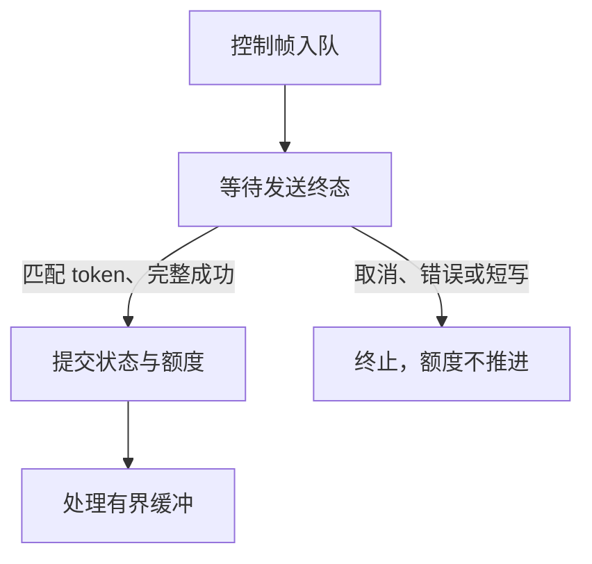

# Salts / SaltsUtils 分阶段迁移

已完成的阶段包括 SHA-256、三个内部容器持有者、异步控制帧发送终态，以及身份绑定核心的加密与随机数迁移、CNet TLS 1.3 三消息身份绑定。根工程仍需要原有 TurboNet、TurboHttp、TurboParser、TurboUtils SDK；仅安装新 SDK 尚不能构建整个产品。

## 审查发现

- **HIGH（事实）**：根工程和传输实现仍依赖 `TurboNet::CoroNet`。新 Salts 导出 CNet，SaltsNet 并未保留旧 CoroNet API。仅改 target 名称会破坏连接、协程及关闭生命周期。第二阶段须迁移 P2P/stream/tunnel 的 transport owner，并验证断连、取消、重连和 TLS。
- **HIGH（事实）**：新 `Salts::Crypto` 提供 SHA-256 和 Ed448，不提供旧 HMAC、wipe、verify 等完整接口。把所有 `turbo_crypto_*` 机械替换会丢失功能；将既有 Ed25519 签名改为 Ed448 会改变协议。因此本阶段只迁移 SHA-256，保留原有非 SHA provider 和签名算法。
- **MED（事实）**：`TurboParser::Parser` 聚合目标以及 `TurboHttp::Iris` 不能靠命名替换迁移。第三阶段按 parser 组件接入 SaltsUtils，并把 HTTP owner 迁到 CHttp，同时验证网关和控制面请求。
- **MED（事实）**：CSTL 改用 `vec_t`/`deque_t`、显式元素大小与对齐、`STL_OK`。本阶段迁移 outbox、endpoint pool、agent router，保留容量限制、FIFO、payload 所有权及错误映射。
- **MED（事实）**：新 TinyTest 使用 `check_equal`，旧类型专用断言已经移除。基础测试同步迁移，根构建按测试选择对应 runtime；其余测试随后续 owner 迁移。

证据入口：本仓库 `CMakeLists.txt`、`mesh/CMakeLists.txt`、`p2p/src/api/p2p_api.c`、`mesh/src/mesh_control_outbox.c`；上游 [Salts](https://github.com/qigao/salts)、[SaltsUtils](https://github.com/qigao/salts-utils)、[SaltsNet](https://github.com/qigao/salts-net)、[CHttp](https://github.com/qigao/chttp) 的 CMake 导出和公共头文件。

## 依赖与缓存

验证快照为 2026-10-01：

| 依赖 | 版本 | 验证来源 |
| --- | --- | --- |
| Salts | 1.8.9 | commit `3e8078f1d7c43cad71bcf44841553fd567704b5e`，源码安装 SDK |
| SaltsUtils | 4.1.14 | commit `1428b495d2a4ba9c113c98616040f68fd21448b6`，[发布流水线](https://github.com/qigao/salts-utils/actions/runs/36800213494) 的 Linux SDK |
| re2c | upstream 4.6 / package 4.6.3 | [vcpkg-cache 发布流水线](https://github.com/qigao/vcpkg-cache/actions/runs/36543809871) 的 host binary |

与 CHttp 一致，CI 使用共享 `setup-vcpkg-cache@master`，并通过 `setup-re2c-tools@master` 恢复最新 `Qigao.Re2c.Binary`。不从 re2c 源码独立 bootstrap，也不使用系统包版本覆盖共享缓存。CI 从 GitHub Packages 恢复最新已发布的 `Salts.Native` 和 `SaltsUtils.Native`，以 `SALTS_ROOT` / `SALTS_UTILS_ROOT` 指向匹配平台的 SDK。

基础测试直接消费安装 SDK，本身不生成 parser。Linux SDK 的 Crypto 依赖 OpenSSL；该测试任务使用 runner 的 `libssl-dev`，关闭 vcpkg manifest 恢复，以免拉入尚未迁移的根工程依赖。共享缓存和 re2c 设置仍由统一 action 提供。

NuGet 实际最新已发布包为 SaltsUtils.Native 4.1.13（首轮 CI 恢复记录）；4.1.14 是源码与 SDK artifact 版本。两版 `crypto/` 及 `cmake/SaltsUtilsConfig.cmake.in` 经 Git diff 确认无差异，消费方不声明依赖版本号，继续恢复 `Version="*"` 的最新发布包。本地同时验证 4.1.14 SDK；所需组件或 API 缺失时直接配置/编译失败。系统 OpenSSL 3.0.13 下也为 9/9 通过。

## 兼容性与取舍

SHA-256 的输入、域分隔、输出长度和现有签名算法保持不变；没有修改协议或持久化格式。CID 定义从文件存储头文件拆到 `m3_chunk_cid.h`，原类型及布局不变，使媒体清单不再通过类型依赖旧文件系统。

选择分阶段迁移是为了分别验证容器/摘要、网络生命周期与 HTTP/parser owner。一次性改名不能覆盖这些接口差异；长期维护一套旧名称兼容层会增加双 runtime 和状态归属风险。基础阶段的主要代价是根构建暂时同时需要新旧 SDK。合并前需具备匹配的 legacy SDK 并运行根工程回归；没有完成该验证之前保留草稿状态。

回滚可撤销本阶段提交并恢复原依赖配置，无需数据迁移。容器生命周期仍由原 owner 管理；初始化失败继续返回既有错误，关闭路径继续释放原有 payload。

## 可重复验证

准备安装 SDK、CMake >= 3.27、C/C++ 编译器和 OpenSSL 开发包，然后设置 `SALTS_ROOT`、`SALTS_UTILS_ROOT`；动态 SDK 还需将相应 `lib` 目录加入运行时库搜索路径。

```sh
cmake -S tests/salts_foundation -B build/salts-foundation -G Ninja -DCMAKE_BUILD_TYPE=Release
cmake --build build/salts-foundation --parallel 2
ctest --test-dir build/salts-foundation --output-on-failure
```

远程 [基础 CI](https://github.com/qigao/turboP2P/actions/runs/36870582481) 已使用 GitHub Packages 的 Salts.Native 1.8.9、SaltsUtils.Native 4.1.13 和缓存 re2c 4.6.3 完成构建，9/9 CTest 通过。版本仅记录验证快照，消费方 CMake 不限制版本。

本地结果：9/9 CTest 通过，覆盖 outbox FIFO/容量、可靠流丢包/重排/恢复、多源选择、媒体索引、playlist、release、媒体拉取及 SHA-256 标准向量/增量/错误状态。endpoint pool 和 agent router 的真实源码通过编译检查；其 P2P 生命周期测试需要根构建，不在这 9 个测试中。

ASan/UBSan 构建也为 9/9 通过。当前执行环境无法让 LeakSanitizer 读取 `/proc`，因此该轮设置 `ASAN_OPTIONS=detect_leaks=0`；不据此声称完成泄漏检测。

尚未验证完整根工程、Windows/macOS、CoroNet/TLS、HTTP 网关和 FlowMQ 集成。后续阶段须验证这些范围后，才能移除 legacy SDK 依赖并宣称完成整个迁移。


## 第二阶段 A：控制帧发送终态

**HIGH（事实）**：旧 `mesh_stream_transport` 在 `io.send()` 返回零时立即提交 ACCEPT / WINDOW_UPDATE；这是同步传输契约。CNet 的 `cnet_send_buffer()` / `cnet_send_slicev()` 返回成功只代表入队，`cnet_observer.on_send` 才报告完整 ordered write 成功。错误或关闭走连接状态回调。若直接换接口，流会提前进入 ACTIVE 或提前增加 advertised window。

本阶段新增内部 `mesh_stream_transport_init_async_v1` 与 `mesh_stream_transport_complete_send_v1`。同步入口继续使用原完成语义，异步入口显式禁止 `io.send`，不能因后端缺失而回退。异步 send 的 token 来自 session preparation generation；终态须匹配 token 和完整编码长度。发送完成前最多保留一个 pending control，暂停后续帧处理，仅保留原 `max_frame_size` 上限内的字节。成功提交后继续处理缓冲，取消/错误/短写使 transport 进入 FAILED，保留已消费 DATA 的事实，不增加额度。



连接与 transport 由同一个 owner 串行推进，不能在 send admission 内完成回调。CNet 的成功回调没有业务 tag，adapter 必须按专属连接的 write FIFO 映射 token，不能混入未登记的写操作。destroy/reinitialize 前须让旧连接回调静默，避免跨 lifetime token 复用。重连应创建新的连接 handle 和授权状态；不能沿用旧 TLS exporter 或 bind ticket。

验证：原同步 transport 测试继续通过；新增延迟完成、WINDOW_UPDATE 取消、短写、重复/过期 token、入队拒绝、有界缓冲测试。真实 CNet TLS 回环验证 exporter 一致、retained buffer 可在入队后释放调用方引用、`on_send` 才激活 ACCEPT、对端解码正确，以及 close-before-progress 不激活 ACCEPT。基础构建增加到 11 个 CTest，Release 和 ASan/UBSan 均为 11/11 通过；sanitizer 轮仍因当前环境限制设置 `detect_leaks=0`。

此阶段仅打通控制帧终态，不替代身份授权。现有三消息身份绑定的 CONFIRM 成功后发布授权、ACCEPT 发送歧义 tombstone，以及 exporter/connection generation 核对，仍需要专用 CNet bind owner 的后续迁移。根工程的 CoroNet owner、HTTP、tunnel 和 P2P transport 尚未切换；不能据此移除全部 legacy SDK。


## 第二阶段 B：身份绑定核心与 TLS 门禁审查

`mesh_mgmt_crypto` 的 BLAKE2b-256、常量时间比较和 secure wipe 改为仓库已有的 `vendor/monocypher`；Ed25519 继续使用 OpenSSL EVP，不能替换成 Monocypher 的 BLAKE2b EdDSA。退休的 TurboNet crypto wrapper 本身也调用这些 Monocypher primitives，固定 16/32 字节比较的返回值继续归一化为原有 0/1。无新增第三方依赖、算法实现或 fallback。`mesh_stream_bind` 的票据 ID 与握手 nonce 改由 `Salts::Platform` 的 `salts_platform_secure_random` 提供。

签名域字符串、Ed25519/BLAKE2b 算法、INIT/ACCEPT/CONFIRM 字节布局、票据容量/TTL、消费与 tombstone 语义保持不变。根工程目标显式链接 Monocypher 和 Salts Platform；绑定核心不再依赖 TurboUtils/TurboNet。独立基础构建增加管理加密和三消息绑定的真实生产源码及测试，测试使用 Salts TinyTest。

**HIGH（事实，已解决）**：此前 CNet 缺少公开协商版本查询，exporter 成功不能证明 TLS 1.3。[Salts #658](https://github.com/qigao/salts/issues/658) 已关闭；当前发布 SDK 提供 `cnet_tls_negotiated_version`。第二阶段 C 在每次 exporter 查询之前校验返回的完整 `TLSv1.3` 字符串，使用公开 API，不读取 CNet 私有状态。

验证包括 RFC 8032 Ed25519 标准向量及篡改拒绝，BLAKE2b-256 空输入、abc 和 129 字节跨块向量，固定长度比较、wipe 与参数错误，以及既有三消息互认证、重放拒绝、exporter 错配、各阶段篡改、票据过期/容量、角色反射、截断输入和 tombstone 测试。回滚可撤销此阶段提交，不涉及数据转换。完整根工程和跨平台 transport owner 验证仍待后续阶段。

本阶段本地 Release 与 ASan/UBSan 均为 13/13 CTest 通过；sanitizer 设置 `detect_leaks=0`，不声称完成泄漏检测。


## 第二阶段 C：CNet 三消息身份绑定

新增内部 `mesh_stream_cnet_adapter`，复用既有绑定核心及 INIT 368 / ACCEPT 232 / CONFIRM 200 字节协议。连接、绑定对象和 responder store 由同一事件循环 owner 串行推进；对象借用 CNet client/handle 和 store，私钥只在签名调用期间借用。输入由调用方按固定握手尺寸组帧，早到的回复须有界缓冲，不能把应用数据交给绑定器。

每次 init、握手推进、发送完成和授权查询都先用 `cnet_tls_negotiated_version` 验证完整 `TLSv1.3`，再导出并核对原 exporter。TLS 1.2、明文、未连接/关闭、stale handle 或 exporter 不匹配均拒绝，不增加版本 pin 或 fallback。INIT / ACCEPT / CONFIRM 的入队成功只保留一份 retained buffer 和 pending 状态；发送完成必须匹配 slot/generation 与完整字节数。initiator 仅在 CONFIRM 的 `on_send` 成功后发布票据；responder 仅在收到、验证 CONFIRM 并一次性消费原 INIT 的票据后授权。

**HIGH（事实，已处理）**：CNet close 是异步命令，排队中的写可能在处理关闭时成功完成。调用方须先 `mesh_stream_cnet_bind_abort_v1` 再请求 close，且在 CLOSED/FAILED 回调中再次 abort。取消、短写、错误和 exporter 失效清除票据、transcript 与 exporter；已接受的 INIT 被 tombstone，迟到或重复 terminal 不恢复授权。一个连接在绑定完成前只能有该 owner 的单个 pending write；不能夹入其他写或在 callbacks 静默前重用对象。init 失败不保留连接或凭据，终态错误后须关闭 borrowed handle。

授权查询同时核对活连接的 TLS 1.3/exporter、票据有效期、remote peer、stream ID/epoch 和 admission generation。代码范例为可运行的 `mesh/tests/test_mesh_stream_cnet_bind.c`。新 target 独立于 CoroNet；完整产品 owner 接线仍属于后续迁移，此阶段不移除根工程的 legacy SDK。

验证使用最新发布的 Salts / SaltsUtils SDK。真实 CNet TLS 1.3 回环覆盖三消息、CONFIRM terminal 才授权、一次性消费、关闭/取消、stale/duplicate terminal、短写、完成时过期、篡改和 exporter 错配。真实 OpenSSL TLS 1.2 client 通过公开 plaintext CNet 驱动，与 CNet TLS listener 握手后确认两端协商版本为 TLS 1.2，验证 binder 在 INIT 入队前拒绝；明文、stale 和关闭连接也拒绝。该负例客户端保留 CA/hostname 校验，针对 GmSSL TLS 1.2 缺少 RFC 5746 的情况仅允许初次 legacy handshake，并禁用 renegotiation；生产门禁仍只接受 TLS 1.3。

当前 GmSSL 拒绝缺少 Basic Constraints 的旧自签名 fixture。CNet 回归改用上游现有的独立 CA/leaf/key 测试链，保持证书和主机名校验，来源与有效期见 `mesh/tests/data/CNET_TLS_FIXTURES.md`。re2c 继续从共享 vcpkg-cache 发布包恢复，consumer 配置继续选 latest SDK。

回滚可撤销本阶段提交，不涉及数据或报文转换。尚未验证完整根工程及 Windows/macOS；P2P、tunnel、HTTP owner 和完整 channel 接线仍待后续阶段。

本地发布包快照：Salts 1.8.15 / SaltsUtils 4.1.17（仅记录验证输入，不限制 consumer 版本）。Release 14/14 CTest、ASan/UBSan 14/14 通过；最后新增 exporter 错配测试后的 sanitizer 绑定回归亦通过。当前环境仍设置 `ASAN_OPTIONS=detect_leaks=0`，不声称完成泄漏检测。
