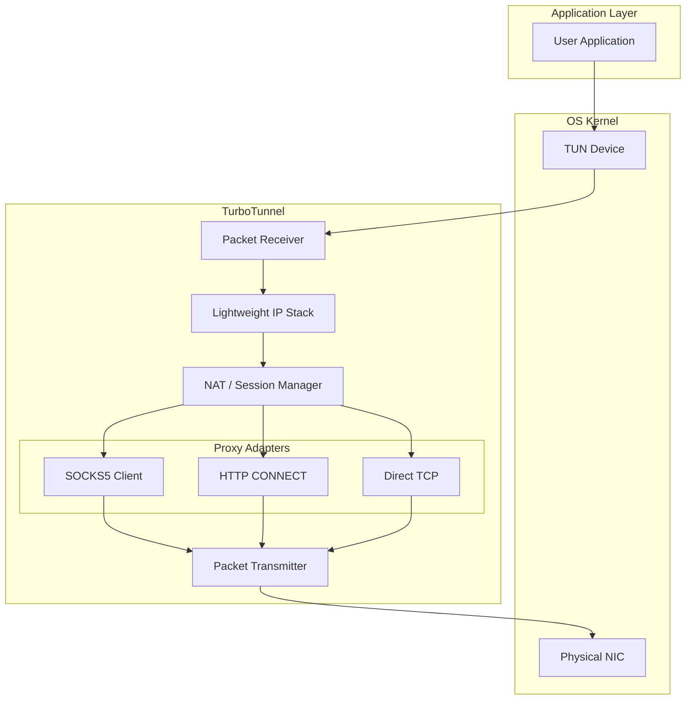

# TurboNet Tunnel Design

## Overview

TurboNet Tunnel is a high-performance **tun2proxy** implementation designed to capture network traffic from a virtual network interface (TUN device) and route it through proxy protocols.

It runs entirely in userspace, providing a lightweight TCP/IP stack implementation to terminate connections and translate them into proxy streams.

## Features

*   **Platform Support**: Linux, macOS, Windows, Android, iOS.
*   **Packet Capture**: Reads raw packets directly from TUN devices.
*   **Userspace IP Stack**: Parses IPv4/IPv6 headers and terminates IPv4 TCP/UDP sessions locally without requiring kernel forwarding.
*   **NAT & Session Management**: Tracks connections with full 5-tuple matching.
*   **Multi-Protocol**:
    *   SOCKS5 CONNECT (RFC 1928)
    *   HTTP CONNECT
    *   Direct TCP (`TUNNEL_PROXY_NONE`)
    *   Shadowsocks, VMess, and Trojan are represented in public configuration but are not implemented as proxy transports yet.
*   **UDP Support**: UDP sessions exist, but SOCKS5 UDP ASSOCIATE and full-cone NAT are not complete.
*   **High Performance**: Zero-copy packet path where possible, built on top of `TurboNet::CoroNet` (libuv + CoroNet).

## Implementation Status

This document describes the current implementation. Planned API surface is called out explicitly instead of being treated as complete behavior.

| Area | Current status |
| --- | --- |
| Event loop | `tunnel_run()` and non-blocking `tunnel_poll()` drive TUN polling plus a `CoroNet` coroutine context. `tunnel_poll()` currently ignores its reserved timeout parameter. |
| TCP proxying | SOCKS5 CONNECT, HTTP CONNECT, and direct TCP are implemented. |
| UDP proxying | UDP session tracking exists; native SOCKS5 UDP ASSOCIATE and full-cone NAT still need transport completion. |
| IPv6 | IPv6 header parsing exists. End-to-end IPv6 NAT, routing, and packet generation are incomplete. |
| Routing rules | `tunnel_create()` and `tunnel_set_routes()` apply IP include/exclude ranges. Domain rules fail with `TUNNEL_ERR_NOT_SUPPORTED` until a trusted domain-to-flow identity is available. |
| Config files | `tunnel_create_from_file()` supports the existing simple key-value parser. YAML string parsing remains a placeholder. |
| Fake DNS | `tunnel_config_t.dns.fake_dns_range` and the persisted `dns.fake_dns_range` key control the FakeDNS CIDR when FakeDNS is enabled; default remains `198.18.0.0/15`. |
| Shadowsocks / VMess / Trojan | Configuration fields exist; proxy handshakes and data transforms are not implemented. |

## Architecture

The system follows a layered architecture where IP packets are intercepted, processed by a lightweight NAT/Session layer, and converted into stream-based proxy connections.



### Data Flow

#### 1. Outgoing Packets (TUN -> Internet)

1.  **Capture**: User application sends a packet to the specific IP CIDR (e.g., `10.0.0.0/8`). The OS routes this to the TUN interface.
2.  **Read**: `tunnel_tun_*` reads the raw IP packet.
3.  **Parsers**: `tunnel_ip_stack` parses IP/TCP/UDP headers.
4.  **Session Lookup**: `tunnel_session` checks if a session exists for the `(SrcIP, SrcPort, DstIP, DstPort, Proto)` tuple.
    *   **New Session**: A new proxy connection is initiated to the configured proxy server.
    *   **Existing Session**: The payload is extracted and queued for the existing proxy connection.
5.  **Proxy Forwarding**: The payload is sent through the selected implemented proxy transport. SOCKS5 and HTTP perform their CONNECT handshakes before data flow; direct mode connects to the target endpoint directly.

#### 2. Incoming Packets (Internet -> TUN)

1.  **Receive**: Data arrives from the proxy server on the physical socket.
2.  **Decapsulation**: The proxy client strips proxy framing where applicable.
3.  **Session Lookup**: The associated internal session is retrieved.
4.  **Packet Generation**: `tunnel_ip_stack` constructs a fake IP packet (e.g., TCP ACK or UDP Response) appearing to come from the original destination IP.
5.  **Write**: The raw packet is written back to the TUN interface.
6.  **Delivery**: The OS receives the packet on the TUN interface and delivers it to the waiting user application.

## Components

### 1. TUN Interface (`src/tun`)
Platform-specific implementations for creating and managing TUN devices.
*   **Windows**: Uses Wintun or TAP-Windows.
*   **Linux/Android**: Uses `/dev/net/tun`.
*   **macOS/iOS**: Uses `utun` devices.

### 2. IP Stack (`src/stack`)
A minimal implementation of TCP/IP required for masquerading. It does *not* implement a full congestion control algorithm. IPv4 TCP/UDP packet building is implemented; IPv6 is currently limited to parsing.

### 3. Session Manager (`src/session`)
The core logic that maps raw IP tuples to proxy client objects. It handles:
*   Connection tracking (conntrack).
*   Timeout management (closing idle connections).
*   LRU eviction for max session limits.

### 4. Proxy Adapters (`src/proxy`)
Protocol implementations that wrap the underlying `CoroNet` streams.
*   **SOCKS5**: Authenticates and sends CONNECT commands.
*   **HTTP**: Sends `CONNECT host:port HTTP/1.1`.
*   **Direct**: Opens a direct TCP stream to the target.
*   **Planned**: SOCKS5 UDP ASSOCIATE, Shadowsocks AEAD, VMess, and Trojan.

## Configuration

Configuration is handled via the `tunnel_config_t` structure or the existing simple key-value file parser. YAML string parsing is still a placeholder and should not be treated as supported behavior yet.

```c
typedef struct {
    tunnel_tun_config_t tun;        /* Device settings (IP, MTU) */
    tunnel_proxy_config_t proxy;    /* Upstream proxy settings */
    tunnel_dns_config_t dns;        /* DNS hijacking and fake DNS */
    tunnel_route_config_t route;    /* Split routing rules */
    // ...
} tunnel_config_t;
```

## FakeDNS / Mesh Boundary

FakeDNS and mesh identity are intentionally separate state domains.

- FakeDNS maps DNS A-record queries to per-tunnel synthetic IPv4 addresses for domain tracking. The default range is `198.18.0.0/15`; callers can set `tunnel_config_t.dns.fake_dns_range` before `tunnel_create()` or `dns.fake_dns_range` in the key-value config file to choose another IPv4 CIDR.
- Mesh virtual IPs, stable `node_id` values, DHT entries, route policy, and peer admission remain owned by `mesh`. The mesh examples expose those through `meshctl` / `meshd` status JSON as `node.virtual_ip`, `node.node_id`, `direct_peers[].virtual_ip`, and `direct_peers[].node_id`.
- Mesh now has a local static MagicDNS map for configured mesh names and virtual IPs. A FakeDNS synthetic address is still not a mesh virtual IP and must not be used as the source of truth for node identity or peer admission.
- The simple key-value file parser exposes `dns.hijack`, `dns.fake`, and `dns.fake_dns_range`.

## MagicDNS / FakeDNS Persistence Plan

Current persisted tunnel configuration is the simple key-value file accepted by `tunnel_create_from_file()`. Its DNS surface includes `dns.hijack`, `dns.fake`, and `dns.fake_dns_range`; unknown DNS keys are ignored by the parser.

Source-of-truth boundaries:

- Tunnel runtime owns packet capture, DNS hijacking, FakeDNS allocation state, and route/session behavior for one `tunnel_t`.
- `tunnel_config_t` is the in-memory source of truth for tunnel creation. `dns.fake_dns_range` is parsed into that structure before tunnel creation.
- The key-value config file is the persisted source of truth for existing tunnel options. It now accepts FakeDNS range, but MagicDNS settings remain mesh-side configuration and are not persisted in tunnel config.
- FakeDNS owns ephemeral domain-to-synthetic-IPv4 mappings. These mappings are cache state and should not be persisted.
- MagicDNS is a separate name-to-mesh-identity layer owned by the mesh/control-plane side. Tunnel should consume already-resolved routing/session intent rather than deriving mesh identity from FakeDNS addresses.

Current safe slice:

- Keep FakeDNS CIDR parsing shared between in-memory and file configuration.
- Reject invalid persisted `dns.fake_dns_range` before tunnel creation side effects.
- Keep absent-key semantics as the default `198.18.0.0/15`.

Future MagicDNS work:

- Expand mesh-side MagicDNS beyond local static records into DNS serving, search-domain handling, and control-plane distribution.
- Do not persist FakeDNS cache mappings; they are derived runtime state.

## Threading Model

TurboNet Tunnel is designed to be single-threaded (per instance) or event-driven, leveraging `CoroNet` on top of the project event loop.

*   **Non-blocking I/O**: All socket and TUN operations are non-blocking.
*   **Event Loop**: `tunnel_poll()` or `tunnel_run()` drives TUN polling and the `CoroNet` coroutine context.
*   **Concurrency**: User acts as the driver; explicitly calling the currently non-blocking `tunnel_poll` allows integration into existing application loops (e.g., game engines or UI threads). The timeout parameter is reserved until TUN and CoroNet waits share one wake mechanism.
