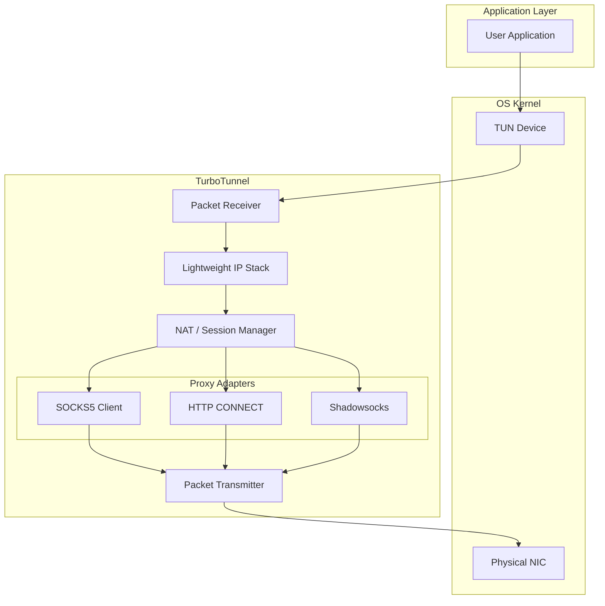

# TurboNet Tunnel Design

## Overview

TurboNet Tunnel is a high-performance **tun2proxy** implementation designed to capture network traffic from a virtual network interface (TUN device) and route it through various proxy protocols (SOCKS5, HTTP, Shadowsocks, etc.).

It runs entirely in userspace, providing a lightweight TCP/IP stack implementation to terminate connections and translate them into proxy streams.

## Features

*   **Platform Support**: Linux, macOS, Windows, Android, iOS.
*   **Packet Capture**: Reads IPv4/IPv6 packets directly from TUN devices.
*   **Userspace IP Stack**: Terminates TCP/UDP connections locally without requiring kernel forwarding.
*   **NAT & Session Management**: Tracks connections with full 5-tuple matching.
*   **Multi-Protocol**:
    *   SOCKS5 (RFC 1928)
    *   HTTP CONNECT
    *   Shadowsocks
    *   VMess / V2Ray
    *   Trojan
*   **UDP Support**: Full UDP association support (SOCKS5 UDP Associate, Full cone NAT).
*   **High Performance**: Zero-copy packet path where possible, built on top of `TurboNet::Core` (libuv + netcore).

## Architecture

The system follows a layered architecture where IP packets are intercepted, processed by a lightweight NAT/Session layer, and converted into stream-based proxy connections.



### Data Flow

#### 1. Outgoing Packets (TUN -> Internet)

1.  **Capture**: User application sends a packet to the specific IP CIDR (e.g., `10.0.0.0/8`). The OS routes this to the TUN interface.
2.  **Read**: `tunnel_tun_*` reads the raw IP packet.
3.  **Parsers**: `tunnel_ip_stack` parses IP/TCP/UDP headers.
4.  **Session Lookup**: `tunnel_session` checks if a session exists for the `(SrcIP, SrcPort, DstIP, DstPort, Proto)` tuple.
    *   **New Session**: A new proxy connection is initiated to the configured proxy server.
    *   **Existing Session**: The payload is extracted and queued for the existing proxy connection.
5.  **Proxy Forwarding**: The payload is encapsulated (e.g., SOCKS5 header added, or encrypted for Shadowsocks) and sent over the physical socket.

#### 2. Incoming Packets (Internet -> TUN)

1.  **Receive**: Data arrives from the proxy server on the physical socket.
2.  **Decapsulation**: The proxy client (e.g., SOCKS5) strips headers or decrypts the payload.
3.  **Session Lookup**: The associated internal session is retrieved.
4.  **Packet Generation**: `tunnel_ip_stack` constructs a fake IP packet (e.g., TCP ACK or UDP Response) appearing to come from the original destination IP.
5.  **Write**: The raw packet is written back to the TUN interface.
6.  **Delivery**: The OS receives the packet on the TUN interface and delivers it to the waiting user application.

## Components

### 1. TUN Interface (`src/tun`)
Platform-specific implementations for creating and managing TUN devices.
*   **Windows**: Uses Wintun or TAP-Windows.
*   **Linux/Android**: Uses `/dev/net/tun`.
*   **macOS/iOS**: Uses `utun` devices.

### 2. IP Stack (`src/stack`)
A minimal implementation of TCP/IP required for masquerading. It does *not* implement a full congestion control algorithm but statefully tracks connection states (SYN_SENT, ESTABLISHED, etc.) to generate valid TCP sequences and ACKs.

### 3. Session Manager (`src/session`)
The core logic that maps raw IP tuples to proxy client objects. It handles:
*   Connection tracking (conntrack).
*   Timeout management (closing idle connections).
*   LRU eviction for max session limits.

### 4. Proxy Adapters (`src/proxy`)
Protocol implementations that wrap the underlying `netcore` sockets.
*   **SOCKS5**: Authenticates and sends CONNECT / UDP ASSOCIATE commands.
*   **HTTP**: Sends `CONNECT host:port HTTP/1.1`.
*   **Shadowsocks**: Handles AEAD encryption/decryption.

## Configuration

Configuration is handled via the `tunnel_config_t` structure or YAML configuration files.

```c
typedef struct {
    tunnel_tun_config_t tun;        /* Device settings (IP, MTU) */
    tunnel_proxy_config_t proxy;    /* Upstream proxy settings */
    tunnel_dns_config_t dns;        /* DNS hijacking and fake DNS */
    tunnel_route_config_t route;    /* Split routing rules */
    // ...
} tunnel_config_t;
```

## Threading Model

TurboNet Tunnel is designed to be single-threaded (per instance) or event-driven, leveraging `libuv`.

*   **Non-blocking I/O**: All socket and TUN operations are non-blocking.
*   **Event Loop**: `tunnel_poll()` or `tunnel_run()` drives the underlying `uv_loop`.
*   **Concurrency**: User acts as the driver; explicitly calling `tunnel_poll` allows integration into existing application loops (e.g., game engines or UI threads).
